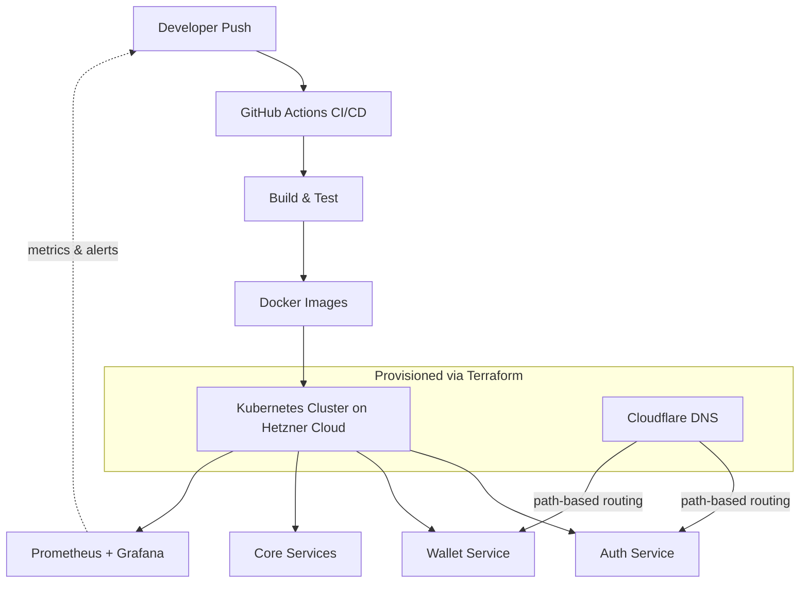

# KoloPay Cloud Infrastructure — Case Study

> **Note:** KoloPay's codebase is private. This is a written case study describing the architecture and work I did, not a source-code repository.

## Context
KoloPay is a pre-launch fintech startup building a budgeting app for the Nigerian market. As the sole DevOps engineer, I was responsible for taking the platform's infrastructure from nothing to launch-ready — provisioning, containerizing, securing, and monitoring it from the ground up.

## What I Built

### 1. Infrastructure as Code
Provisioned isolated, secure environments on **Hetzner Cloud** using **Terraform** — managing subnets, firewalls, and load balancers as version-controlled code rather than manual console setup.

### 2. Containerization & Orchestration
Containerized core microservices with **Docker** and **Docker Compose**, then deployed them to a **Kubernetes** cluster to keep services highly available as the platform approached launch.

### 3. CI/CD
Designed and implemented **GitHub Actions** pipelines that automated deployment and testing — cutting manual deployment/testing cycles by **70%** for the development team.

### 4. Monitoring & Observability
Configured **Prometheus** and **Grafana** to track infrastructure metrics in real time, giving the team visibility into launch-readiness rather than finding out about problems after the fact.

### 5. Networking & Traffic Routing
Configured **Cloudflare DNS** with path-based routing rules to securely direct traffic to isolated microservices — including the auth and wallet modules, where routing mistakes have real security consequences.

## Architecture

## Why This Mattered
A pre-launch fintech has one shot at a stable launch — infrastructure problems that surface post-launch hit real users and real money. The priority throughout was reducing manual, error-prone steps (deployment, provisioning) and replacing "hope it works" with "we'll know before users do" via monitoring and alerting.

## Stack
`Terraform` `Docker` `Docker Compose` `Kubernetes` `Hetzner Cloud` `GitHub Actions` `Prometheus` `Grafana` `Cloudflare`

---
*Code is private/proprietary to KoloPay. Happy to walk through specific technical decisions in an interview.*
